```{r setup, include=FALSE}
knitr::opts_chunk$set(echo = TRUE)
```
Introduction

Business Context

Bellabeat is a wellness technology company focused on creating smart products designed specifically for women. Their devices track physical activity, sleep, stress, and reproductive health to promote holistic wellbeing. Bellabeat emphasizes combining stylish design with health insights to support a balanced lifestyle. Their products serve as lifestyle partners, helping women monitor both mental and physical health. The brand is known for female-centric features and empowering users through personalized wellness data. Sršen, co-founder of Bellabeat, has requested an analysis of smart device usage data to gain insights into how consumers—especially women—use non-Bellabeat tracking devices. The objective is to understand key user behaviors, identify trending features, and explore opportunities to improve Bellabeat’s product offerings and marketing strategy.

Guiding Problem

  The primary problem identifying which trends are most relevant to Bellabeat’s target audience.
  The goal is to reduce internal bias by examining the behaviours of users from competing products and using those findings to:
  •	Improve Bellabeat’s existing product features
  •	Tailor marketing campaigns based on real consumer behaviour
  •	Provide stakeholders with evidence-based recommendations for product development
  Stakeholders
  •	Bellabeat co-founders
  •	The marketing team
  •	Product development and design teams

Datasets

The data used in this analysis comes from the publicly available FitBit Fitness Tracker Data provided by Möbius on Kaggle. It includes anonymized activity, sleep, heart rate, and weight data collected from 33 to 35 users over a period of 31 to 60 days between March and May 2016. Four key datasets were utilized: dailyActivity_merged.csv (tracking total steps, activity intensity levels, sedentary minutes, and calories burned), heartrate_seconds_merged.csv (second-by-second heart rate data in BPM), sleepDay_merged.csv (sleep duration, number of sleep records, and time spent in bed), and weightLogInfo_merged.csv (user weight in kilograms, BMI, and manual/automatic entry type). The activity, heart rate, and weight data were originally split across two separate datasets covering different time periods—12/03/2016 to 11/04/2016 and 12/04/2016 to 12/05/2016—and this analysis will later combine them using the rbind() function to ensure a continuous timeline for analysis. The sleep data is already consolidated and did not require merging.
  
  
Business Task Statement

To gain insights into trends in women’s behavior with competitor smart tracking devices in order to guide Bellabeat’s marketing strategy and product development, helping the brand better connect with existing and potential customers.


# Install packages

```{r install-packages, eval=FALSE}
options(repos = c(CRAN = "https://cloud.r-project.org"))

install.packages("tidyverse") # (ggplot2, dplyr,tidyr,readr, stringr etc...)
install.packages("lubridate") # Manipulation of date/time
install.packages("corrplot")  # Correlation heat map
```

# Load packages

```{r load-packages}
library(tidyverse)
library(lubridate)
library(corrplot)
```

# Bind and load data sets

The rbind() function was used to combine matching data for Activity, Heart Rate and Weight data sets from two distinct periods  — March 12 to April 11, 2016, and April 12 to May 12, 2016 — as they were stored in separate datasets. This allowed for the creation of a continuous dataset covering the full date range for consistent analysis. As all sleep records were already consolidated in one dataset, no additional merging was necessary using the rbind() function.

```{r Link-data-sets}
Activity <- rbind(read.csv("C:/Users/emma3/Downloads/Fitabase Data 4.12.16-5.12.16/dailyActivity_merged2.csv"),read.csv("C:/Users/emma3/Downloads/mturkfitbit_export_3.12.16-4.11.16/dailyActivity_merged.csv"))

Weight <- rbind(read.csv("C:/Users/emma3/Downloads/Fitabase Data 4.12.16-5.12.16/weightLogInfo_merged.csv"),read.csv("C:/Users/emma3/Downloads/mturkfitbit_export_3.12.16-4.11.16/weightLogInfo_merged1.csv"))

Heartrate <- rbind(read.csv("C:/Users/emma3/Downloads/Fitabase Data 4.12.16-5.12.16/heartrate_seconds_merged.csv"), read.csv("C:/Users/emma3/Downloads/mturkfitbit_export_3.12.16-4.11.16/heartrate_seconds_merged1.csv"))

Sleep <- read.csv("C:/Users/emma3/Downloads/Fitabase Data 4.12.16-5.12.16/sleepDay_merged.csv")
```

# Visualise Data

The head() function was used to preview the first few rows of the dataset, allowing for a quick inspection of the column structure and a general understanding of the data.

```{r head}
head(Activity)
head(Weight)
head(Heartrate)
head(Sleep)
```

# Inspecting Data Formats

The str() function was used to examine the structure of the dataset and verify that the column formats were consistent and appropriate for analysis.

```{r str}
str(Activity)
str(Weight)
str(Heartrate)
str(sleep) 
```

The date and time values in the datasets were initially stored as character strings rather than in proper date-time formats. Time values used the 12-hour clock format with AM/PM indicators instead of the standard 24-hour format (HH:MM:SS). Additionally, dates followed the U.S. format (MM/DD/YYYY), which differs from the UK format (DD/MM/YYYY).
In terms of structure, the activity dataset recorded only the date (without specific times), whereas the sleep dataset included time stamps. However, all time entries in the sleep dataset were set to 00:00:00, offering no variation in time-of-day information.

# Adjusting Dates

### Dates format

The as.POSIXct() function was used to convert character strings into proper date-time format, enabling accurate time-based analysis.

The Sys.timezone() function was applied to ensure that the timestamps aligned with the system’s actual time zone, maintaining consistency in time-related data.

Additionally, time was reformatted to the UK standard (DD/MM/YYYY HH:MM:SS) to improve readability and prevent confusion. The reformatted values were stored in a new column named "FormattedTime".

For Weight, Heartrate and Sleep data sets, the format function was used with the %I:%M:%S %p directive to correctly interpret and format time values stored in the 12-hour clock format with AM/PM indicators, as found in the original datasets.
Since Sleep Data set time are all 00:00:00 and don't indicate any specific time where people felt asleep, only the date is relevant and was kept.

```{r Date-ampm}
Weight$Date <- as.POSIXct(Weight$Date, format="%m/%d/%Y %I:%M:%S %p", tz= Sys.timezone())
Weight$FormattedTime <- format(Weight$Date, format = "%d/%m/%Y %H:%M:%S")

Heartrate$Time <- as.POSIXct(Heartrate$Time, format="%m/%d/%Y %I:%M:%S %p", tz= Sys.timezone())
Heartrate$FormattedTime <- format(Heartrate$Time, format = "%d/%m/%Y %H:%M:%S")

Sleep$SleepDay <- as.POSIXct(Sleep$SleepDay, format="%m/%d/%Y %H:%M:%S", tz= Sys.timezone())
Sleep$FormattedTime <- format(Sleep$SleepDay, format = "%d/%m/%Y")
```

Since the Activity dataset includes only dates (without time) and uses the U.S. date format, only the date component was reformatted to the U.K. style for consistency and clarity.

```{r Adjust-date-type}
Activity$ActivityDate <- as.POSIXct(Activity$ActivityDate, format="%m/%d/%Y", tz= Sys.timezone())
Activity$FormattedTime <- format(Activity$ActivityDate, format = "%d/%m/%Y")
```
### Remove previous date variable

Since a new date-time variable has been created in the U.K. format, the original date columns are no longer needed and can be safely removed to avoid redundancy.

```{r Remove-previous-date}
Activity <- Activity %>% select(-ActivityDate)
Weight <- Weight %>%  select(-Date)
Heartrate <- Heartrate %>% select(-Time)
Sleep <- Sleep %>% select(-SleepDay)
```

# Distinct values

The n_distinct() function was used to count the number of unique participant IDs in each dataset, providing insight into the sample size and ensuring no duplicate records are counted.

```{r ndistinct}
n_distinct(Activity$Id)          
n_distinct(Weight$Id)            
n_distinct(Heartrate$Id)         
n_distinct(Sleep$Id)             
```

# Mean steps

Evaluate whether, on average, users achieve the widely recommended daily target of 10,000 steps, based on guidelines by Tudor-Locke & Bassett (2004), to assess overall physical activity levels.

```{r mean-steps}
mean(Activity$TotalSteps, na.rm = TRUE)
```
Average steps = 7281, the mean doesn't reach daily steps recommendation

# Creating New Variables

### Total Active Minutes

Generate a new column that sums Lightly Active, Fairly Active, and Very Active minutes to represent the total daily active minutes, enabling easier analysis of overall activity levels.

```{r total-active-minutes}
Activity <- Activity %>%
  mutate(TotalActiveMinutes = LightlyActiveMinutes + FairlyActiveMinutes + VeryActiveMinutes)
```

### Awake Sedentary Time

Generate a new column for sedentary time that doesn't take into account sleeping time and where sleeping time higher than sedentary time is not taken into account (After checking Sedentary awake time values some are negative and cannot be accounted as not accurate since total minutes asleep cannot be more than sedentary time).

```{r awake-sedentary-time}
Activity$FormattedTime <- dmy(Activity$FormattedTime) # parse the datetime columns
Sleep$FormattedTime <- dmy(Sleep$FormattedTime)

Activity %>% count(Id, FormattedTime) %>% filter(n > 1) # check if id/formatted time have unique values
Sleep %>% count(Id, FormattedTime) %>% filter(n > 1)

Sleep_unique <- Sleep %>%
  distinct(Id, FormattedTime, .keep_all = TRUE) # remove duplicates

Activity_unique <-Activity %>% 
  distinct(Id, FormattedTime, .keep_all = TRUE)

Activity <- Activity_unique %>%   # join Sleeping time and Sedentary time that belong to two different data frames
  full_join(
    Sleep_unique[, c("Id", "FormattedTime", "TotalMinutesAsleep")],
    by = c("Id", "FormattedTime") # group new column by Id and date
  ) %>%
  arrange(Id, FormattedTime) %>%
  mutate(
    SedentaryAwakeTime = ifelse(
      SedentaryMinutes > TotalMinutesAsleep,
      SedentaryMinutes - TotalMinutesAsleep, NA)) # only keep values where Sedentary > Sleep, else NA
# value_if_true, value_if_false (NA)
```

### Time In Bed Awake

Generate a new column for the time spent in bed awake by subtracting Sleeping time to Time in bed.

```{r time-in-bed-awake}
Sleep$TimeInBedAwake <- Sleep$TotalTimeInBed - Sleep$TotalMinutesAsleep
```


# Means

Now, let's examine the average values (means) for the key variables in our dataset to better understand overall trends.

### Sleep

```{r Sleep}
Sleep %>% 
  select(TimeInBedAwake, TotalMinutesAsleep, TotalSleepRecords) %>% 
  summary()
```
Time spent awake in bed ranges widely from 0 to 371 minutes, with an average around 39 minutes. Total minutes asleep vary between 58 and 796, averaging about 420 minutes. Most records have just one sleep entry, though some have up to three.

### Activity 

```{r Activity}

Activity %>% 
  select(TotalSteps, VeryActiveMinutes, FairlyActiveMinutes, LightlyActiveMinutes, TotalActiveMinutes, SedentaryAwakeTime) %>% 
  summary() 
```
Daily total steps range from 0 to 36,019, with an average around 7,377 steps. Very active minutes vary widely (0–210) but average about 20 minutes, while fairly and lightly active minutes average 14 and 188 minutes respectively. Total active minutes average 222, and sedentary daytime minutes average around ??????????? per day.

### Weight

```{r Weight}

Weight %>% 
  select(BMI, WeightKg) %>% 
  summary() 
```
BMI values range from 21.45 to 47.54, with a mean of about 25.37, while weights range from 52.6 kg to 133.5 kg, averaging 72.5 kg.


### Heart rate

```{r Heart-rate}

Heartrate %>% 
  select(Value) %>% 
  summary()
```
Heart rate values span from 36 to 203 bpm, with an average around 78 bpm and a median of 74 bpm.


# Daily Activity Breakdown

### Activity

```{r Activity-specific-days}
summary_weekday <- Activity %>%
  group_by(weekday) %>%
  summarise(
    avg_steps = mean(TotalSteps, na.rm = TRUE),
    avg_SedentaryAwakeTime = mean(SedentaryAwakeTime, na.rm = TRUE), 
    avg_TotalActiveMinutes = mean(TotalActiveMinutes, na.rm = TRUE),
    avg_Calories = mean(Calories, na.rm = TRUE)
  ) %>%
  mutate(weekday = factor(weekday,levels = c("Monday", "Tuesday", "Wednesday", "Thursday", "Friday", "Saturday", "Sunday"))) # order weekdays Monday to Sunday order rather than alphabetically (mutate).


plot_data <- summary_weekday %>%
  pivot_longer(cols = starts_with("avg_"),
               names_to = "Metric",
               values_to = "Value")

ggplot(plot_data, aes(x = weekday, y = Value, fill = Metric)) +
  geom_col(position = "dodge") +
  facet_wrap(~ Metric, scales = "free_y") +  # separate y-axis scales per metric
  labs(
    title = "Average Activity by Day of the Week",
    x = "Day of the Week",
    y = "Average Value",
    fill = "Metric"
  ) +
  theme_minimal() +
  theme(axis.text.x = element_text(angle = 45, hjust = 1))
```
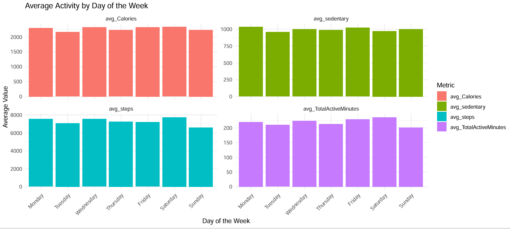

The bar chart show a slightly higher activity and less sedentarity on the weekend but not a big difference between weekend and weekdays.

### Sleep
```{r sleep-specific-days}
summary_sleep <- Sleep %>%
  group_by(weekday) %>%
  summarise(
    avg_timeAsleep = mean(TotalMinutesAsleep, na.rm = TRUE),
    avg_timeInBed = mean(TotalTimeInBed, na.rm = TRUE),
  ) %>%
  mutate(weekday = factor(weekday,levels = c("Monday", "Tuesday", "Wednesday", "Thursday", "Friday", "Saturday", "Sunday")))

plot_sleep <- summary_sleep %>%
  pivot_longer(cols = starts_with("avg_"),
               names_to = "Metric",
               values_to = "Value")

ggplot(plot_sleep, aes(x = weekday, y = Value, fill = Metric)) +
  geom_col(position = "dodge",
           color = "black",
           size = 0.1          
  ) +
  labs(
    title = "Average Time in Bed vs Time Asleep by Weekday",
    x = "Day of the Week",
    y = "Time (minutes)",
    fill = "Metric"
  ) +
  theme_minimal() +
  theme(axis.text.x = element_text(angle = 45, hjust = 1))

```
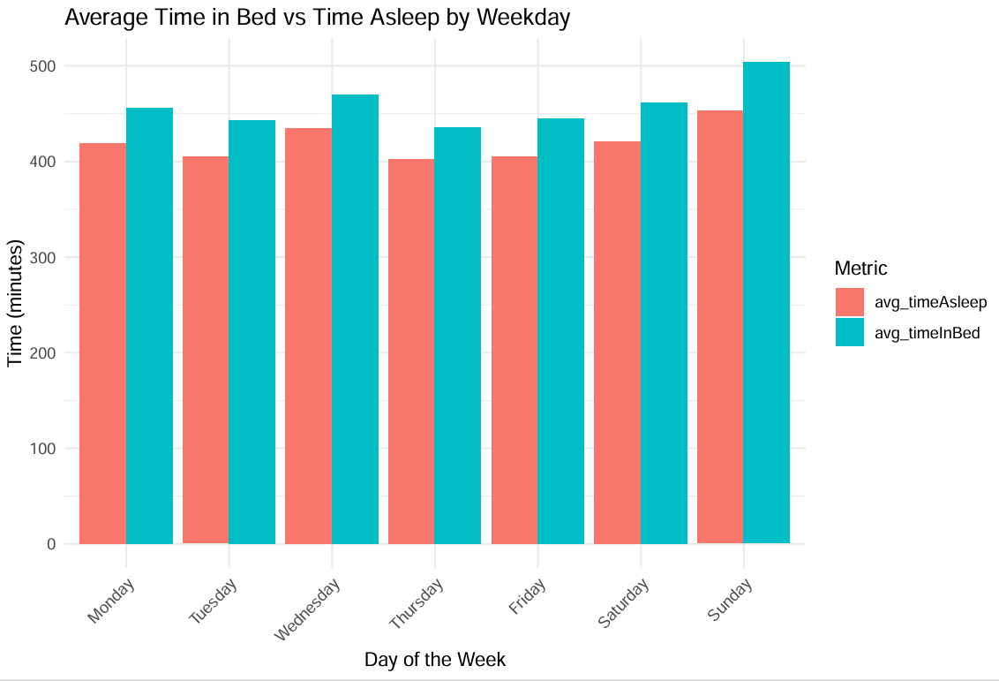

Sleep patterns indicate increased average sleep duration and Time in Bed without sleeping on weekends mainly on Sunday and a midweek peak on Wednesday, suggesting variability tied to work and rest cycles.

### Heart Rate

```{r heart-rate-specific-days}
summary_heartrate <- Heartrate %>%
  group_by(weekday) %>%
  summarise(
    avg_bpm = mean(Value, na.rm = TRUE),
  ) %>%
  mutate(weekday = factor(weekday,levels = c("Monday", "Tuesday", "Wednesday", "Thursday", "Friday", "Saturday", "Sunday")))

plot_heartrate <- summary_heartrate %>%
  pivot_longer(cols = starts_with("avg_"),
               names_to = "Metric",
               values_to = "Value")

ggplot(plot_heartrate, aes(x = weekday, y = Value, fill = Metric)) +
  geom_line(size = 1.2)+
  geom_point(size = 2)
labs(
  title = "Average Heart rate by Weekday",
  x = "Day of the Week",
  y = "Heartrate (BPM)",
  fill = "Metric"
) +
  theme_minimal() +
  theme(axis.text.x = element_text(angle = 45, hjust = 1))

# BPM is very slightly higher on Saturday and lower on Monday, Tuesday and Wednesday.
```
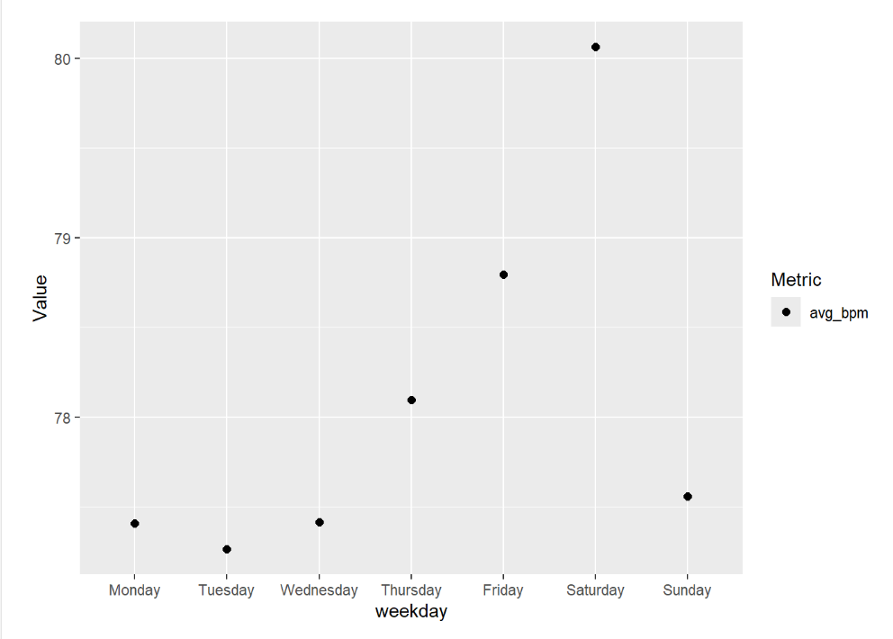

Average heart rate shows a slight increase on Saturday, while Monday, Tuesday, Wednesday, and Sunday exhibit comparatively lower values. However the differences betweens days are light as average BPM is at its lowest on Tuesday (77.3/bpm) and at its highest on Saturday (80.5/bpm).

### Weight

```{r weight-specific-days}
summary_weight <- Weight%>%
  group_by(weekday) %>%
  summarise(
    avg_weight = mean(WeightKg, na.rm = TRUE),
    avg_BMI = mean(BMI, na.rm = TRUE),
  ) %>%
  mutate(weekday = factor(weekday,levels = c("Monday", "Tuesday", "Wednesday", "Thursday", "Friday", "Saturday", "Sunday")))

plot_weight <- summary_weight %>%
  pivot_longer(cols = starts_with("avg_"),
               names_to = "Metric",
               values_to = "Value")

ggplot(plot_weight, aes(x = weekday, y = Value, fill = Metric)) +
  geom_col() +
  facet_wrap(~ Metric, scales = "free_y") +
  labs(
    title = "Average Weight by Day of the Week",
    x = "Day of the Week",
    y = "Weight (Kg)",
    fill = "Metric"
  ) +
  theme_minimal() +
  theme(axis.text.x = element_text(angle = 45, hjust = 1))
```

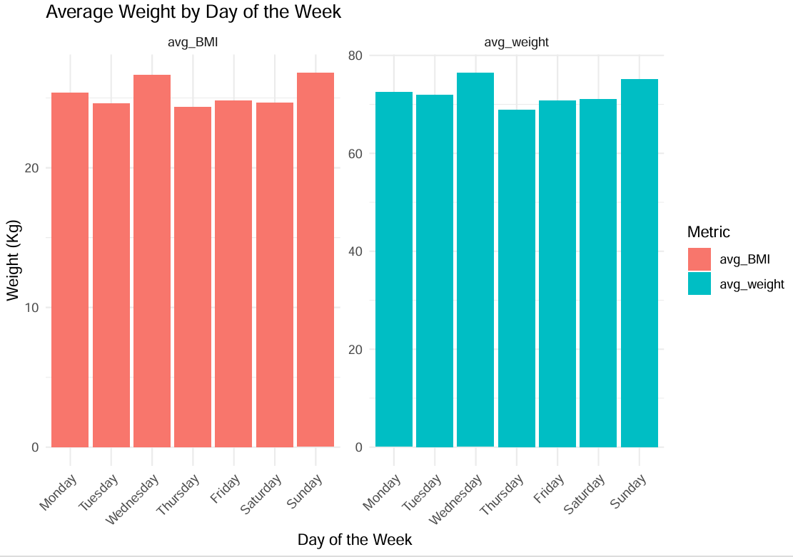

Weight and BMI higher on Wednesday and Sunday.

# Correlations

Firstly, to enable correlation analysis across all data frames, a common column named “Date” was created in each dataset. This column contains only the date portion (day/month/year) without any time information, ensuring consistency since some data frames include hours, minutes, and seconds while others do not. This standardization allows for accurate merging and comparison based solely on the date.

```{r date}
Activity$Date <- as.Date(Activity$FormattedTime, format = "%d/%m/%Y") 
Sleep$Date <- as.Date (Sleep$FormattedTime, format = "%d/%m/%Y")
Heartrate$Date <- as.Date(Heartrate$FormattedTime, format = "%d/%m/%Y %H:%M:%S") 
Weight$Date <- as.Date(Weight$FormattedTime, format = "%d/%m/%Y %H:%M:%S") 
```

The Heart Rate dataset contains a large number of records since measurements were taken every 5 minutes throughout each day. To simplify the data and align it with other datasets that have only one record per day, the next step is to aggregate the Heart Rate data by calculating the daily average. This reduces multiple entries per day to a single representative value, facilitating easier comparison and analysis across datasets.

```{r Average-daily-heart-rate}
Heartrate_daily <- Heartrate %>% 
  group_by(Id, Date) %>% 
  summarize(AvgHeartRate = mean(Value, na.rm = TRUE)) 
```


## Multi correlation matrix

A new data frame called Allmerged is created by merging the four main datasets using the common keys Id and Date, consolidating all relevant information into a single comprehensive table for analysis.

```{r Multi-correlation-Matrix}
Allmerged <- list(Sleep, Weight, Activity, Heartrate_daily) %>% 
  reduce(full_join, by = c("Id", "Date"))
```

Before running the correlation matrix, unnecessary variables were removed to simplify the dataset and improve clarity.

```{r remove-uneeded}
Allmerged <- Allmerged %>% select(-Id, -Fat, -TotalDistance, -TotalSleepRecords, -TotalMinutesAsleep.y, -WeightPounds, -TotalTimeInBed, - LogId, -LoggedActivitiesDistance, -TrackerDistance, -VeryActiveDistance, -ModeratelyActiveDistance, -LightActiveDistance, -SedentaryActiveDistance)
```
Only the numeric columns were selected from the dataset to prevent errors during analysis.

```{r only-numeric}
numeric_data <- Allmerged %>% select(where(is.numeric))
```
To prevent errors, each numeric column was checked for a standard deviation of zero (indicating all values are identical), and the results were stored as a logical vector.

```{r check-sd}
zero_var_cols <- sapply(numeric_data, function(x) sd(x, na.rm = TRUE) == 0) 
```
Only the columns in numeric_data that do not have zero variance were retained for further analysis.

```{r numeric-sd-only}
numeric_data_filtered <- numeric_data[, !zero_var_cols]
```
A correlation matrix was created using all relevant numeric variables to provide a clearer understanding of the relationships between them.

```{r corrmatrix}
cor_matrix <- cor(numeric_data, use = "pairwise.complete.obs") 
print(cor_matrix)
```
A plot of the correlation matrix was generated to visually highlight the strength and direction of relationships between the numeric variables for easier interpretation.

```{r corrplot}
corrplot(cor_matrix, 
         method = "color",       # use colored tiles instead of numbers or circles
         type = "upper",         # show only the upper triangle (to avoid repetition)
         tl.cex = 0.8,           # text label size for variable names
         number.cex = 0.5,       # size of the numbers (correlation values)
         addCoef.col = "black",  # color of coefficients
         tl.srt      = 55,       # rotate labels 55 degrees
         tl.col = "darkred")     # color labels
```

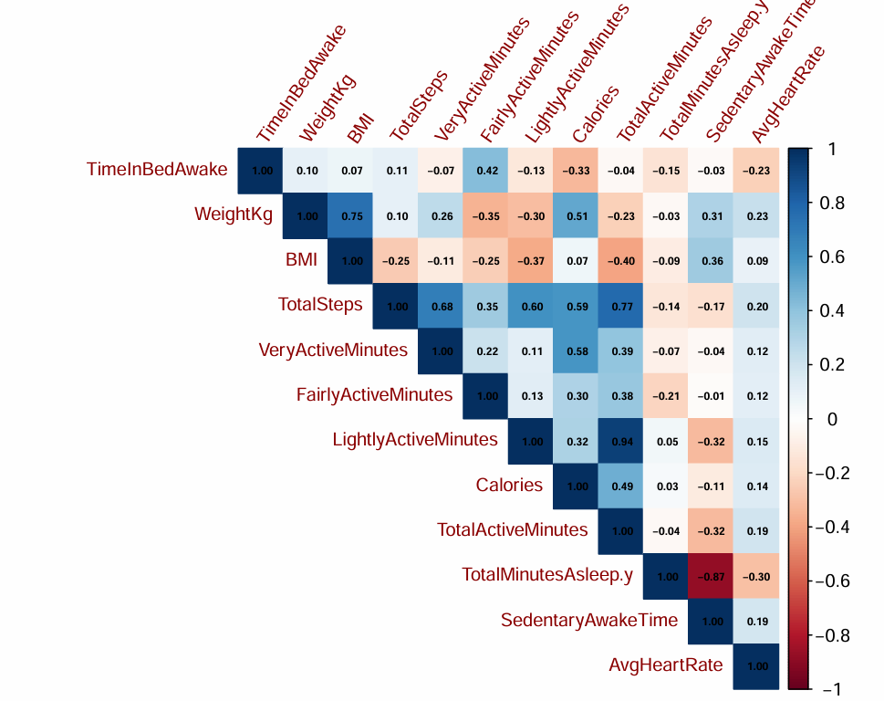

The correlation matrix reveals several interesting relationships between variables. To gain a deeper understanding, individual correlation tests and corresponding plots will be created for the most notable correlations highlighted in the matrix.

## 1- Sedentary time correlate with total sleeping time (without accounting for sedentary time spend sleeping).

```{r Sedentary-Sleep}

cor.test(Activity$SedentaryAwakeTime, Activity$TotalMinutesAsleep, use = "complete.obs")

# r(342) = -0.89, p < .001 (Very strong negative correlation/Very significant).

plot(Activity$SedentaryAwakeTime, Activity$TotalMinutesAsleep,
     main = "Sedentary Minutes vs Total Sleep",
     xlab = "Sedentary Minutes (awake)",
     ylab = "Total Minutes Asleep",
     pch = 19, col = "darkblue")
abline(lm(TotalMinutesAsleep ~ SedentaryAwakeTime, data = Activity), col = "red", lwd = 2) # adding a trend line (linear regression)
```
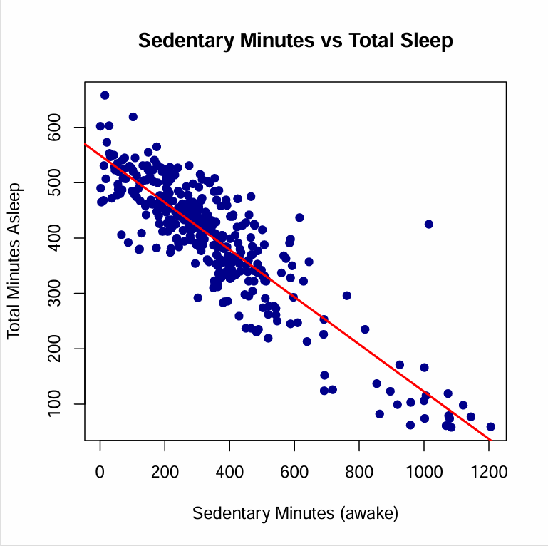

A very strong negative correlation was found between sedentary minutes and sleep duration, indicating that individuals who are more sedentary are likely to sleep less.

## 2- Heart rate correlate with sleeping time

```{r Heart -rate-sleep}
Heartrate_daily <- Heartrate %>% 
  group_by(Id, Date) %>% 
  summarize(AvgHeartRate = mean(Value, na.rm = TRUE)) 
# Aggregate the Heart Rate data by computing the daily average, in order to reduce multiple values per day and match them with the corresponding single daily Sleep record.

HeartbeatSleep <- merge(Heartrate_daily, Activity, by= c("Id", "Date")) 

cor.test(HeartbeatSleep$AvgHeartRate, HeartbeatSleep$TotalMinutesAsleep)

# r(179)= -0.26, p<.001 (Weak negative correlation, very significant).


plot(HeartbeatSleep$AvgHeartRate, HeartbeatSleep$TotalMinutesAsleep,
     main = "Heart Rate vs Total Sleep",
     xlab = "Heart Rate",
     ylab = "Total Minutes Asleep",
     pch = 19, col = "darkblue")
abline(lm(TotalMinutesAsleep ~ AvgHeartRate, data = HeartbeatSleep), col = "red", lwd = 2) # adding a trend line (linear regression)
```


There is a negative correlation between sleep duration and heart rate, suggesting that more sleep is associated with lower resting heart rates.

## 3- Heart Rate correlates with Sedentary time

```{r Heart-rate-sedentary-time}
HeartrateActivity <- merge(Heartrate_daily, Activity, by= c("Id", "Date")) # using awake sedentary time rather than sedentary time (including sleeping time) as Sleep naturally lowers heart rate (due to parasympathetic activity)

cor.test(HeartrateActivity$AvgHeartRate, HeartrateActivity$SedentaryAwakeTime)

# r(156)= 0.20, p<.05 (Weak positive correlation, statistically significant)

ggplot(HeartrateActivity, aes(x = SedentaryAwakeTime, y = AvgHeartRate)) +
  geom_point(alpha = 0.6) +
  geom_smooth(method = "lm", se = FALSE, color = "blue") +
  labs(title = "Avg Heart Rate vs Sedentary Awake Time",
       x = "Sedentary Awake Time (mins)",
       y = "Average Heart Rate") +
  theme_minimal()
```
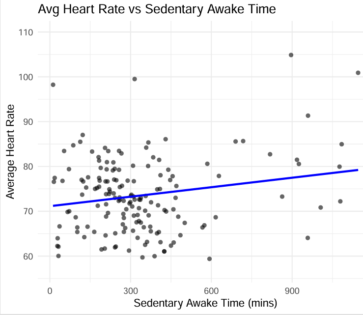

A slight positive correlation was observed between sedentary time and average heart rate, suggesting that individuals who are more sedentary may tend to have higher resting heart rates.

## 4- Total Active Minutes and Steps

```{r active-minutes-steps}
cor.test(Activity$TotalActiveMinutes, Activity$TotalSteps)

# r(1371)= 0.77, p<.001 (Very strong positive correlation, very significant)


ggplot(Activity, aes(x= TotalActiveMinutes, y= Activity$TotalSteps))+
  geom_point(alpha= 0.6)+
  geom_smooth(method = "lm", se= FALSE, Color="blue")+
  labs(title= "Total Active Time vs Steps",
       x= "Total Daily Active Time (min)",
       y= "Daily Steps")+
  theme_minimal()
```
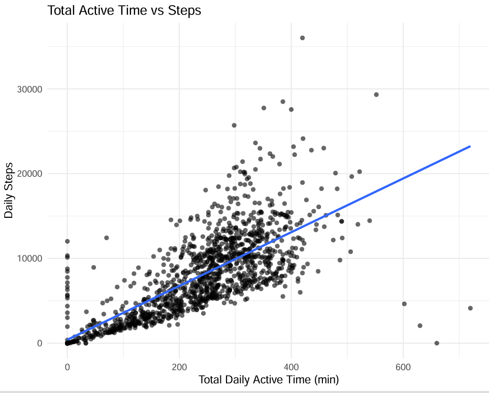

The correlation between Total Active Minutes and Total Steps is very strong (r = 0.77, p < .001), indicating a significant and positive linear relationship. This suggests that individuals who spend more time being active tend to take more steps throughout the day. The strong correlation also implies that a large portion of daily physical activity is likely made up of walking or stepping-based movement, reinforcing the role of step count as a key component of overall activity levels.

## 5- Calories and Very Active minutes

```{r Calories-Very-active-minutes}
cor.test(Activity$Calories, Activity$VeryActiveMinutes)

# r(1371) =0.59p<.001 (positive correlation, Very significant)

ggplot(Activity, aes(x=Calories, y=VeryActiveMinutes))+
  geom_point(alpha=0.6)+ #60% opaque
  geom_smooth(method = "lm", se= FALSE, Color="blue")+ # linear model, False = hides shaded confidence interval
  labs(title= "Calories vs Very Active Minutes",
       x= "Calories",
       y="Very Active Minutes")+
  theme_minimal()
```
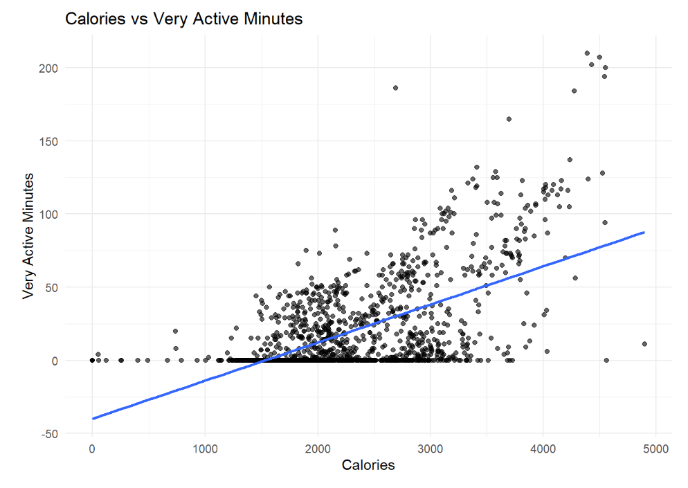

There is a clear positive correlation between Very Active Minutes and Calories Burned, indicating that as the amount of very active time increases, the number of calories burned also tends to rise.
 
## 6- Calories and Steps

```{r Calories-steps}
cor.test(Activity$Calories, Activity$TotalSteps)

# r(1371)=0.58, p<.001 (positive correlation, very significant)

ggplot(Activity, aes(x=Calories, y=TotalSteps))+
  geom_point(alpha=0.6)+
  geom_smooth(method = "lm", se= FALSE, Color="blue")+
  labs(title = "Calories vs Steps",
       x="Daily Caloric expenditure",
       y="Daily Steps")+
  theme_minimal()
```
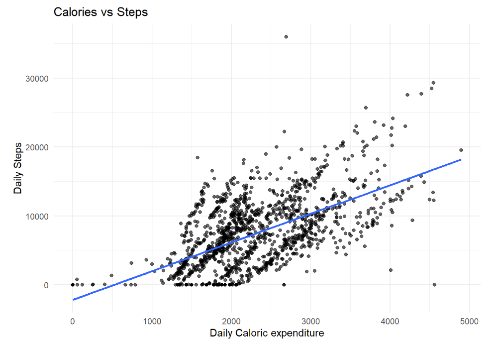

There is a positive relationship between daily step count and calorie burnt, indicating that individuals who walk more steps tend to expend more calories throughout the day.
 
## 7- Time in Bed (Awake) and Fairly Active minutes

```{r Awake-time-bed-fairly-active}
cor.test(Allmerged$TimeInBedAwake, Allmerged$FairlyActiveMinutes)
# r(412)=0.32, p<.001 (weak positive correlation, very significant)


ggplot(Allmerged, aes(x=TimeInBedAwake, y=FairlyActiveMinutes))+
  geom_point(alpha=0.6)+
  geom_smooth(method="lm", se=FALSE, Color="blue")+
  labs(title="Time in Bed Awake vs Daily Fairly Active Minutes",
       x="Time in Bed Awake (min)",
       y="Daily Fairly Active Minutes")+
  coord_cartesian(xlim = c(0, 200), ylim = c(0, 200)) +  # zoom to focus area without dropping data
  theme_minimal()
```

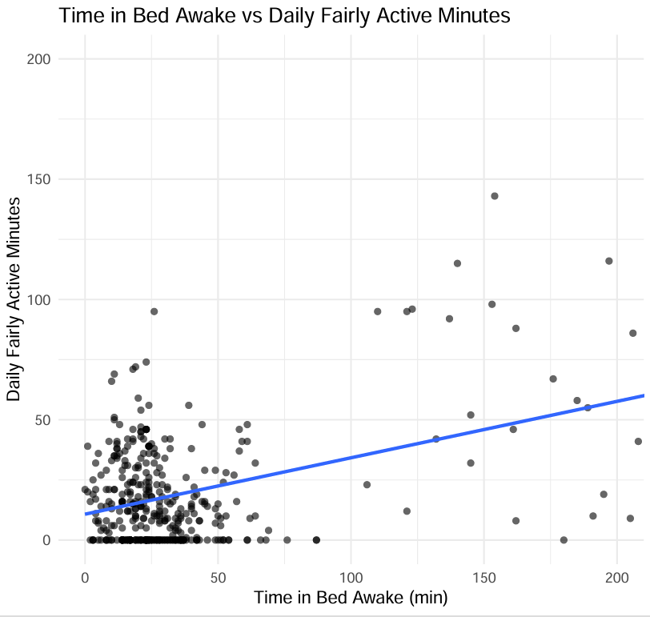

The more time Daily fairly active time is spent the more time in bed is spent before and after sleeping and vice versa. Because correlation does not imply causation, this association highlights a connection but doesn’t clarify the direction of influence. Those results could indicate that spending time in bed helps relaxation and increases motivation for the rest of the day resulting in higher fairly active time but it could also indicate that longer fairly active time leads to the need of more time to relax once in bed.


# Summary of Analysis

## Key findings from the data analysis include:

### Activity Trends
The average daily step count was 7,281—well below the recommended 10,000. Users were more active on Saturdays and least active on Fridays and Sundays. Weekends showed slightly more active minutes and lower sedentary behavior.

### Sleep Patterns 
Users sleep longer on weekends, especially on Sundays. A significant portion of time in bed is spent awake,         particularly on weeknights.

### Heart Rate Insights
Slightly elevated average heart rate on weekends. Weak negative correlation between heart rate and sleep duration.

### Weight and BMI
Slight increase in weight and BMI over weekends, peaking on Sundays and Wednesdays. Correlation Highlights: Strong positive correlation between total active minutes and step count (r = 0.77). Moderate positive correlation between very active minutes and calories burned. Strong negative correlation between sedentary awake time and total sleep (r = -0.89). Slight positive correlation between sedentary awake time and heart rate.

## Key Insight Summaries
Less activity correlates with reduced sleep and slightly higher heart rate. Most users do not meet daily activity guidelines. User behaviors differ significantly between weekdays and weekends, affecting sleep, heart rate, and calorie burn.


## Based on the analysis, the following strategic recommendations are proposed for Bellabeat:

### 1. Introduce Personalized Activity Nudges

Insight: Most users do not meet the 10,000-step daily recommendation; activity is lowest on weekdays,especially Fridays.
Action: Use app notifications to encourage short bursts of movement during sedentary periods, especially during workdays.
Example: “Take 1,000 steps by 3 PM to hit your daily goal!”


### 2. Emphasize Weekend Wellness Features

Insight: Users sleep more and are slightly more active on weekends.
Action: Launch weekend wellness campaigns featuring mindfulness, recovery, hydration tracking, and sleep rituals. “Recharge Sundays”:Guided breathing + hydration reminders + sleep prep content.
    
    
### 3. Create Smart Sleep Coaching

Insight: There's a strong negative correlation between sedentary time and sleep; many users spend time in bed awake. Action: Offer in-app sleep coaching to help users improve sleep efficiency (not just duration), including: Pre-bed routines: Light/stretch reminders before sleep. Content to reduce "awake in bed" time (e.g., sleep stories, relaxation sounds)
    
### 4. Launch Heart Health Awareness Tools

Insight: Higher sedentary time is weakly correlated with higher heart rate. Action: Introduce heart rate monitoring insights that detect patterns and offer tips (e.g., breathing exercises, movement alerts).“We noticed your heart rate is elevated—want to take a 3-minute breathing break?”
    
### 5. Add Adaptive Daily Goals

Insight: Activity and sleep levels vary by day of the week.
Action: Use machine learning to adapt daily step or sleep goals based on user trends (e.g., higher weekend activity). Adjusted    expectations may improve user satisfaction and consistency.

### 6. Implement “Lifestyle Snapshot” Dashboards

Insight: Correlation analysis showed meaningful connections between activity, heart rate, sleep, and calories. Action: Provide users   with a weekly health summary combining: Steps, Heart rate trends, Sleep efficiency, Calories burned. Example: “This week you were most active on Saturday. Sleep improved on days with less sedentary time.”

### 7. Gamify Movement & Sleep

Insight: Users fall short on physical activity and may benefit from motivation. Action: Add achievements, badges, and streaks for:     Meeting step goals, Improving sleep efficiency, Lowering resting  heart rate over time.


## Area for future research

### 1. Audience Segmentation

Further research could explore how different age groups of female  users engage with wearable technology. Specifically: Do younger   women (ages 20–35) prioritize fitness tracking, step goals, and the visual/aesthetic appeal of devices? Do older women (ages 35+) place more value on features that support wellness, heart health, sleep monitoring, and stress management?
    
### 2. Competitive Differentiation

Further exploration could assess whether Bellabeat can create a stronger market position by focusing on holistic wellness rather than traditional fitness tracking alone. Specifically: Do users respond more positively to devices that support both physical and mental wellbeing, such as stress reduction, sleep quality,  mindfulness, and emotional balance?
Would framing Bellabeat as a lifestyle partner—rather than a step counter—better align with the needs and expectations of its core       audience?
    
  
### 3. Female-Specific Health Features
    
Further development could explore how Bellabeat can better support women’s unique health needs by integrating features tailored to       different life stages. Specifically: Do users benefit from tracking tools related to menstrual cycles, fertility windows, and hormonal  fluctuations? Could women entering perimenopause and menopause find value in tools focused on stress management, sleep support, and     holistic wellness guidance?
    
Understanding these preferences could help Bellabeat tailor its product features and marketing messages to better meet the distinct needs of these segments.
